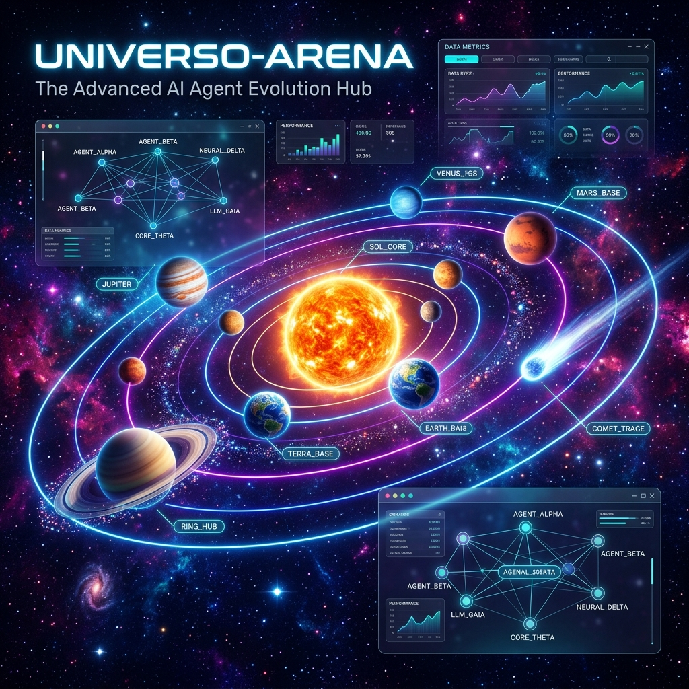

# 🌌 Universo-Arena

<p align="center">
  
</p>

### Un mismo prompt. 17 combinaciones de LLM + agente de código. Una sola pasada. ¿Quién construye el mejor universo 3D?

<p align="center">
  
  
  
  
  
</p>

<p align="center">
  
  
  
  
</p>


**Universo-Arena** es un *benchmark* abierto que enfrenta a distintos modelos de lenguaje (LLM) y agentes de codificación ante un mismo reto exigente: implementar, en **un único `index.html` autocontenido**, una **simulación 3D del Sistema Solar con BabylonJS** siguiendo al pie de la letra [`Prompt-Maestro_v2.txt`](Prompt-Maestro_v2.txt).

Cada carpeta del repositorio contiene la entrega de una combinación distinta — y su **nombre indica el modelo y el agente usados** (p. ej. `Opus-4.8-Claude-Code` = *Claude Opus 4.8* con *Claude Code*; `codex-gpt-5.5` = *GPT‑5.5* con *Codex*).

> 🔭 **[Ver la galería interactiva con resultados, fichas y demos en vivo →](index.html)**
> *(abre `index.html` en la raíz: ranking, radar por categorías, capturas reales y enlace a cada simulación)*

---

## 🎯 El reto

`Prompt-Maestro_v2.txt` no es un *"hola mundo"*. Pide una escena completa y físicamente plausible en un solo archivo, sin assets locales ni servidor:

- ☀️ **Sol** central emisivo con corona de partículas, pulso de escala y luz puntual.
- 🪐 **8 planetas + Plutón** (enano) con **órbitas elípticas** (Sol en el foco), velocidad orbital tipo **Kepler** (inversa a la distancia), inclinación de plano orbital, eje axial propio y etiquetas billboard.
- ☄️ **Cometa Halley** con órbita excéntrica y **cola que siempre apunta en sentido opuesto al Sol** (recalculada cada frame).
- 🌑 **Cinturón de asteroides** (200+), **anillos de Saturno**, **3000+ estrellas** de fondo y **nebulosas** procedurales.
- 🎬 **Post‑procesado** (bloom + glow + tone mapping), cámara `ArcRotateCamera` con auto‑rotación y **panel de configuración** con 4 secciones y decenas de controles.
- 📜 **Regla absoluta:** consultar la documentación oficial de BabylonJS (vía *context7*) **antes** de escribir código y **no inventar APIs**.

Todo ello generado en **una sola pasada** por cada agente.

---

## 🧪 Metodología

La evaluación combina **tres señales independientes** para evitar tanto la subjetividad como las alucinaciones del juez:

1. **Rúbrica de 100 puntos** sobre 10 categorías (escena, fidelidad orbital, cometa Halley, estética, panel UI, cámara, post‑procesado, rendimiento, robustez y calidad de código). Un jurado‑LLM por implementación leyó el `index.html` completo y el spec, y puntuó **verificando el código, no los comentarios**.
2. **Ejecución real en Chrome *headless*** (WebGL vía SwiftShader) de las 17 entregas: se capturó **captura de pantalla**, número de **mallas en escena**, **FPS** y, sobre todo, **errores de consola y excepciones** reales. Ningún archivo se juzga solo por su código: se juzga por lo que hace al abrirse.
3. **Calibración adversarial + corrección por *runtime*.** Un juez final normalizó las notas entre jurados. Donde la revisión estática contradijo la ejecución real, **mandó la ejecución real** (ver "El caso GLM‑5.2" más abajo).

> Orquestado con un *pipeline* multi‑agente (15+ subagentes): un evaluador por entrega en paralelo, un calibrador, y re‑evaluaciones dirigidas para las contradicciones. Toda la data cruda vive en [`assets/benchmark.json`](assets/benchmark.json) y [`assets/runtime.json`](assets/runtime.json).

---

## 🏆 Resultados

<!-- TABLES:START -->
### 🏆 Ranking global

| # | | Modelo | Agente / Herramienta | Puntuación | Tier | Errores consola | Líneas | Demo |
|--:|:--|:--|:--|:--:|:--:|:--:|--:|:--:|
| 1 | 🥇 | **GPT-5.5** | Codex | **97** | S | ✅ 0 | 1496 | [▶](codex-gpt-5.5/index.html) |
| 2 | 🥈 | **Claude Opus 4.8** | Ultracode + Claude Code | **97** | S | ✅ 0 | 1496 | [▶](Opus-4.8-Ultracode-Extension-Claude-Code/index.html) |
| 3 | 🥉 | **GLM 5.2** 🆕 | OpenCode | **95** | S | ✅ 0 | 1080 | [▶](Opencode-GLM-5.2/index.html) |
| 4 |  | **Claude Opus 4.8** | Claude Code | **95** | S | ✅ 0 | 995 | [▶](Opus-4.8-Claude-Code/index.html) |
| 5 |  | **Gemini 3.5 (High)** 🆕 | Antigravity | **92** | S | ✅ 0 | 1533 | [▶](Antigravity-Gemini-3.5-High/index.html) |
| 6 |  | **MiniMax M3** | Claude Code | **92** | S | ✅ 0 | 1062 | [▶](Minimax-M3-Claude-Code/index.html) |
| 7 |  | **Gemini 3.5 Flash** | Antigravity CLI | **89** | A | ✅ 0 | 1637 | [▶](Agy-Gemini-3.5-Flash-Antigravity-CLI/index.html) |
| 8 |  | **GLM 5.2** | Claude Code | **89** | A | ✅ 0 | 1306 | [▶](GLM-5.2-Claude-Code/index.html) |
| 9 |  | **GLM 5.2 (Max)** 🆕 | Zcode | **89** | A | ✅ 0 | 1275 | [▶](Zcode-GML-5.2-Max/index.html) |
| 10 |  | **DeepSeek V4 Pro** | CodeWhale | **88** | A | ✅ 0 | 1251 | [▶](codewhale-deepseek-v4-pro/index.html) |
| 11 |  | **Claude Sonnet 4.6** | Antigravity IDE | **86** | A | ✅ 0 | 1592 | [▶](Claude-Sonnet-4.6-Antigravity-IDE/index.html) |
| 12 |  | **Kimi K2.7** | Claude Code | **80** | B | ⚠️ 1 | 696 | [▶](Kimi-k.7-code-Claude-Code/index.html) |
| 13 |  | **Kimi K2.7** | Kimi Code CLI | **79** | B | ⚠️ 1 | 541 | [▶](kimi-k2.7-code-Kimi-Code-CLI/index.html) |
| 14 |  | **MiniMax M3** | mini-agent | **79** | B | ✅ 0 | 1100 | [▶](mini-agent-MiniMax-M3/index.html) |
| 15 |  | **DeepSeek V4 Pro** | Pi Coding Agent | **78** | B | ✅ 0 | 1276 | [▶](deepseek-v4-pro-Pi-Coding-Agent/index.html) |
| 16 |  | **Devstral** | Vibe | **70** | C | ✅ 0 | 960 | [▶](vibe-devstral/index.html) |
| 17 |  | **Z.ai GLM 5.2** | Claude Code | **54** | D | ✅ 0 | 624 | [▶](Zai-GLM-5.2-Claude-Code/index.html) |

### 📊 Desglose por categoría

| Modelo (agente) | Escena /20 | Órbitas /12 | Halley /8 | Estética /15 | UI /15 | Cámara /8 | Post-pro /6 | Rend. /6 | Robustez /5 | Código /5 | **Total** |
|:--|:--:|:--:|:--:|:--:|:--:|:--:|:--:|:--:|:--:|:--:|:--:|
| GPT-5.5 · Codex | 19 | 12 | 8 | 13 | 15 | 8 | 6 | 6 | 5 | 5 | **97** |
| Claude Opus 4.8 · Ultracode + Claude Code | 19 | 12 | 8 | 13 | 15 | 8 | 6 | 6 | 5 | 5 | **97** |
| GLM 5.2 · OpenCode | 19 | 12 | 8 | 13 | 14 | 8 | 6 | 6 | 4 | 5 | **95** |
| Claude Opus 4.8 · Claude Code | 19 | 10 | 8 | 13 | 15 | 8 | 6 | 6 | 5 | 5 | **95** |
| Gemini 3.5 (High) · Antigravity | 18 | 12 | 8 | 11 | 15 | 7 | 6 | 6 | 4 | 5 | **92** |
| MiniMax M3 · Claude Code | 19 | 11 | 8 | 12 | 14 | 8 | 6 | 4 | 5 | 5 | **92** |
| Gemini 3.5 Flash · Antigravity CLI | 19 | 9 | 8 | 12 | 14 | 8 | 6 | 5 | 4 | 4 | **89** |
| GLM 5.2 · Claude Code | 20 | 11 | 4 | 13 | 15 | 8 | 6 | 4 | 4 | 4 | **89** |
| GLM 5.2 (Max) · Zcode | 18 | 9 | 8 | 11 | 15 | 7 | 6 | 6 | 4 | 5 | **89** |
| DeepSeek V4 Pro · CodeWhale | 19 | 11 | 8 | 11 | 14 | 7 | 6 | 3 | 4 | 5 | **88** |
| Claude Sonnet 4.6 · Antigravity IDE | 18 | 9 | 4 | 12 | 15 | 8 | 6 | 5 | 4 | 5 | **86** |
| Kimi K2.7 · Claude Code | 17 | 9 | 3 | 11 | 15 | 7 | 6 | 3 | 4 | 5 | **80** |
| Kimi K2.7 · Kimi Code CLI | 18 | 9 | 4 | 11 | 14 | 7 | 6 | 3 | 4 | 3 | **79** |
| MiniMax M3 · mini-agent | 17 | 9 | 3 | 11 | 14 | 7 | 6 | 3 | 4 | 5 | **79** |
| DeepSeek V4 Pro · Pi Coding Agent | 19 | 5 | 4 | 12 | 13 | 7 | 6 | 3 | 5 | 4 | **78** |
| Devstral · Vibe | 15 | 9 | 3 | 10 | 11 | 7 | 6 | 4 | 2 | 3 | **70** |
| Z.ai GLM 5.2 · Claude Code | 9 | 11 | 5 | 7 | 4 | 6 | 0 | 4 | 3 | 5 | **54** |

### ✅ Matriz de cumplimiento

| Modelo (agente) | Órbitas elípticas | Cola Halley correcta | Cinturón | Instancing | Anillos Saturno | Plutón | 3000+ estrellas | Nebulosas | Bloom/Glow | Panel completo | Vistas cámara | deltaTime |
|:--|:--:|:--:|:--:|:--:|:--:|:--:|:--:|:--:|:--:|:--:|:--:|:--:|
| GPT-5.5 · Codex | ✅ | ✅ | ✅ | ✅ | ✅ | ✅ | ✅ | ✅ | ✅ | ✅ | ✅ | ✅ |
| Claude Opus 4.8 · Ultracode + Claude Code | ✅ | ✅ | ✅ | ✅ | ✅ | ✅ | ✅ | ✅ | ✅ | ✅ | ✅ | ✅ |
| GLM 5.2 · OpenCode | ✅ | ✅ | ✅ | ✅ | ✅ | ✅ | ✅ | ✅ | ✅ | ✅ | ✅ | ✅ |
| Claude Opus 4.8 · Claude Code | ✅ | ✅ | ✅ | ✅ | ✅ | ✅ | ✅ | ✅ | ✅ | ✅ | ✅ | ✅ |
| Gemini 3.5 (High) · Antigravity | ✅ | ✅ | ✅ | ✅ | ✅ | ✅ | ✅ | ✅ | ✅ | ✅ | ✅ | ✅ |
| MiniMax M3 · Claude Code | ✅ | ✅ | ✅ | — | ✅ | ✅ | ✅ | ✅ | ✅ | ✅ | ✅ | ✅ |
| Gemini 3.5 Flash · Antigravity CLI | ✅ | ✅ | ✅ | ✅ | ✅ | ✅ | ✅ | ✅ | ✅ | ✅ | ✅ | ✅ |
| GLM 5.2 · Claude Code | ✅ | — | ✅ | — | ✅ | ✅ | ✅ | ✅ | ✅ | ✅ | ✅ | ✅ |
| GLM 5.2 (Max) · Zcode | ✅ | ✅ | ✅ | ✅ | ✅ | ✅ | ✅ | ✅ | ✅ | ✅ | ✅ | ✅ |
| DeepSeek V4 Pro · CodeWhale | ✅ | ✅ | ✅ | — | ✅ | ✅ | ✅ | ✅ | ✅ | ✅ | ✅ | ✅ |
| Claude Sonnet 4.6 · Antigravity IDE | ✅ | — | ✅ | ✅ | ✅ | ✅ | ✅ | ✅ | ✅ | ✅ | ✅ | ✅ |
| Kimi K2.7 · Claude Code | ✅ | — | ✅ | — | ✅ | ✅ | ✅ | ✅ | ✅ | ✅ | ✅ | ✅ |
| Kimi K2.7 · Kimi Code CLI | ✅ | — | ✅ | — | ✅ | ✅ | ✅ | ✅ | ✅ | ✅ | ✅ | ✅ |
| MiniMax M3 · mini-agent | ✅ | — | ✅ | — | ✅ | ✅ | ✅ | ✅ | ✅ | ✅ | ✅ | ✅ |
| DeepSeek V4 Pro · Pi Coding Agent | — | — | ✅ | — | ✅ | ✅ | ✅ | ✅ | ✅ | ✅ | ✅ | ✅ |
| Devstral · Vibe | ✅ | — | ✅ | — | — | ✅ | — | ✅ | ✅ | — | ✅ | ✅ |
| Z.ai GLM 5.2 · Claude Code | ✅ | ✅ | — | — | ✅ | — | — | — | — | — | — | ✅ |
<!-- TABLES:END -->

---

## 🔬 Análisis comparativo

**Lo que separó a los mejores: dos trampas de corrección de dominio.** Casi todas las entregas "se ven bien", pero el spec esconde dos detalles que solo se resuelven con razonamiento físico real:

1. **El Sol en el *foco* de la elipse, no en el centro.** Una elipse con el Sol centrado es geométricamente trivial y *parece* correcta; ponerlo en el foco (`x = a·cosθ − a·e`) requiere entender la órbita. El grupo de cabeza (GPT‑5.5, ambos Opus, DeepSeek‑CodeWhale, GLM‑5.2) lo hizo; otros (Gemini, Sonnet 4.6) dejaron el Sol en el centro y perdieron fidelidad.
2. **La cola del cometa Halley.** Es **el bug más discriminante del benchmark**. El vector "lejos del Sol" es `cometa − Sol`; muchísimas entregas lo invirtieron (`.negate()`, `.scale(-1)` o un `normalize()` mal usado) y **la cola acabó apuntando hacia el Sol** — justo lo contrario de la física. Falló en Sonnet 4.6, ambos Kimi, MiniMax‑mini‑agent, DeepSeek‑Pi, Devstral y, por una mutación *in‑place* de `Vector3.normalize()`, también en GLM‑5.2 y Z.ai‑GLM‑5.2. Acertarlo fue el sello de las entregas de tier S/A altas.

**La trampa de rendimiento: *instancing*.** El cinturón de 200‑260 asteroides es un caso de libro para `createInstance`/*thin instances*. Lo resolvieron GPT‑5.5, los dos Opus 4.8, Gemini y **las tres entradas de la 2.ª tanda** (OpenCode, Antigravity y Zcode); buena parte del resto creó cientos de mallas y materiales independientes (cientos de *draw calls*), lo que explica los FPS bajos.

**El agente importa tanto como el modelo — y la 2.ª tanda lo confirma.** Un mismo LLM rinde distinto según su andamiaje: **MiniMax M3** sube de 79 (mini‑agent) a **92** (Claude Code). El caso extremo es **GLM 5.2**, ahora con cuatro combinaciones: **95 (OpenCode) · 89 (Claude Code) · 89 (Zcode·Max) · 54 (Z.ai)** — una dispersión de **41 puntos** sobre el mismo modelo base. El *scaffolding* del agente —planificación, consulta de documentación, auto‑verificación— levanta (o hunde) la misma base.

> **2.ª tanda (2026‑06‑17):** se añadieron 3 entradas (14 → 17) con la misma metodología. Sus notas se **verificaron contra el *runtime*** y se ajustaron a la baja (99→95, 95→92, 92→89) para no destronar el 97 calibrado sin re‑baremar. Detalle en [`docs/segunda-tanda-2026-06-17.md`](docs/segunda-tanda-2026-06-17.md).

**La regla absoluta predijo los fallos.** Las entregas que ignoraron la consulta de documentación tendieron a **inventar APIs** — `emissionRange`, `mesh.diameter` (Devstral) — que se traducen directamente en bugs visibles (estrellas sin distribuir, anillos en `NaN`). Verificar la documentación no fue burocracia: fue corrección.

### ⚖️ El caso GLM‑5.2: cuando el juez‑LLM alucina y el *runtime* corrige

La revisión estática inicial sentenció a **GLM‑5.2‑Claude‑Code** con un *"bug fatal, pantalla negra"* por unos *strings* de color mal cerrados. **La ejecución real lo desmintió:** 279 mallas en escena, **0 excepciones**, UI completa y bloom activo (ver su captura en la galería). Los *strings* defectuosos existen, pero el navegador los tolera y la escena se construye entera. La nota se corrigió de un injusto 38 a **89**. Moraleja metodológica: **un juez‑LLM sobre código estático sobre‑penaliza; sin ejecución real, un benchmark de agentes no es fiable.**

---

## ✅ Conclusiones

- **El listón base es altísimo.** Las **17** entregas arrancan y renderizan una escena WebGL compleja (1000+ líneas) en una sola pasada, y **15 de 17 con cero errores de consola**. Generar una app 3D autocontenida y funcional ya es terreno resuelto para los agentes frontera.
- **La frontera ya no es "¿funciona?" sino "¿acierta los detalles difíciles?":** foco orbital, signo de un vector, *instancing*, degradación elegante. Ahí se decide todo.
- **Profundidad vs. amplitud.** La mejor mecánica orbital del benchmark (Z.ai‑GLM‑5.2, con Kepler real por Newton‑Raphson) se quedó en el tier D por **entregar una escena incompleta** (sin Plutón, sin asteroides, sin nebulosas, sin post‑procesado). Resolver lo difícil no compensa dejar lo fácil a medias.
- **El andamiaje del agente es un multiplicador**, no un detalle: el mismo modelo gana o pierde un *tier* según su agente.
- **Evaluar agentes exige ejecutarlos.** La corrección de GLM‑5.2 muestra que la revisión estática y la ejecución real discrepan, y que la verdad está en el *runtime*.

---

## 🌐 Estado del arte (junio 2026)

La generación *one‑shot* de una experiencia 3D web compleja y autocontenida ha dejado de ser una hazaña: es el **comportamiento esperable** de un agente de código frontera. Hace poco la pregunta era *"¿puede un LLM escribir 1500 líneas de WebGL que ni siquiera lancen una excepción?"*; hoy la respuesta es *sí, casi siempre*, y el debate se ha desplazado a la **corrección de dominio** y la **disciplina de ingeniería**: entender que el Sol va en el foco, que un vector tiene sentido, que 250 objetos piden *instancing* y que una API debe verificarse antes de usarse.

Los diferenciadores ya no son sintácticos sino **de razonamiento**: física, geometría y arquitectura de rendimiento. Y de forma reveladora, **el agente/andamiaje pesa tanto como el modelo base** — la planificación, la consulta de documentación y los bucles de auto‑verificación convierten a un modelo competente en uno sobresaliente. La cabeza de la tabla la comparten un *Claude Opus 4.8* y un *GPT‑5.5* prácticamente empatados, con *MiniMax M3* y *Gemini 3.5 Flash* demostrando que el pelotón frontera es ancho y multi‑proveedor.

Por último, este ejercicio deja una lección sobre **cómo se deben medir** los agentes: el *LLM‑as‑judge* sobre código estático es rápido pero falible (llegó a declarar "rota" una entrega que funcionaba perfectamente). El estándar emergente —y el que aquí se aplica— es **juzgar por ejecución**: abrir la app, contar sus objetos, mirar su consola y capturar lo que el usuario realmente ve. El estado del arte de los agentes es excelente; el estado del arte de su *evaluación* apenas empieza a ponerse a su altura.

---

## 📚 Documentación

Toda la documentación vive en [`docs/`](docs/):

| Documento | Contenido |
|:--|:--|
| [docs/methodology.md](docs/methodology.md) | Cómo se evaluó (las tres señales) y sus límites. |
| [docs/rubric.md](docs/rubric.md) | La rúbrica de 100 puntos y las dos "trampas" de corrección. |
| [docs/results.md](docs/results.md) | Ficha detallada de las 17 entregas. |
| [docs/harness.md](docs/harness.md) | El arnés técnico y cómo reproducirlo. |
| [docs/conclusions.md](docs/conclusions.md) | Análisis comparativo y estado del arte (extendido). |
| [docs/contributing.md](docs/contributing.md) | Cómo añadir una nueva entrada. |
| [docs/deployment.md](docs/deployment.md) | Infraestructura de despliegue y webhook de auto-deploy (CD). |
| [docs/seo-geo-2026-06-15.md](docs/seo-geo-2026-06-15.md) | SEO + GEO/AEO: Open Graph/Twitter, `llms.txt`, `sitemap.xml`, JSON-LD. |
| [docs/security-audit-2026-06-15.md](docs/security-audit-2026-06-15.md) | Auditoría de ciberseguridad (websec-100): headers OWASP, CSP, `security.txt`. |
| [docs/pagespeed-2026-06-15.md](docs/pagespeed-2026-06-15.md) | PageSpeed/Lighthouse **100/100/100/100**. |

### 🏅 Calidad de producción

El sitio en vivo está auditado y optimizado con la familia de skills `-100`:

- **PageSpeed/Lighthouse 100/100/100/100** (Performance · Accessibility · Best Practices · SEO; PSI mobile) — LCP 1.1 s, CLS 0, TBT 0 ms.
- **Seguridad:** HTTPS forzado (308), HSTS preload-ready, CSP, COOP/CORP, Permissions-Policy, `security.txt` y bloqueo de paths sensibles. **0 violaciones CSP** verificadas en navegador real.
- **SEO + IA:** tarjetas sociales por red (Open Graph/Twitter), `robots.txt`, `sitemap.xml`, datos estructurados JSON-LD y `llms.txt`/`llms-full.txt` para LLMs.

Historial de cambios en [`CHANGELOG.md`](CHANGELOG.md).

## 📁 Estructura del repositorio

```
Universo-Arena/
├── index.html                  ← 🌐 galería interactiva de resultados (ábrela)
├── README.md                   ← este documento
├── CHANGELOG.md · CLAUDE.md · LICENSE
├── Prompt-Maestro_v2.txt       ← el reto que todos implementaron
├── docs/                       ← metodología, rúbrica, resultados, arnés, conclusiones
├── assets/
│   ├── benchmark.json          ← fuente de verdad del benchmark (notas, features, runtime)
│   ├── runtime.json            ← datos objetivos de ejecución (meshes, errores)
│   ├── universo_arena_banner.png
│   └── previews/*.png          ← capturas reales de cada simulación
└── <Modelo>-<Agente>/index.html   ← una carpeta por entrega (14)
```

## ▶️ Cómo usarlo

- **Sitio Web de Producción:** Accede a la galería en vivo en **[https://universo-arena.alexanderoviedofadul.dev](https://universo-arena.alexanderoviedofadul.dev)**.
- **Galería local:** abre [`index.html`](index.html) en la raíz con doble clic.
- **Una simulación concreta:** abre el `index.html` de su carpeta. Requiere conexión a internet (BabylonJS por CDN).
- **Despliegue y Webhook (CD):** El proyecto cuenta con integración y despliegue continuo mediante webhook. Cualquier push en `main` actualiza los archivos automáticamente. Ver detalles en [`docs/deployment.md`](docs/deployment.md).
- **Documentación y reproducibilidad:** ver [`docs/`](docs/).

## 📜 Licencia y créditos

Código bajo licencia [MIT](LICENSE). Reto y curación: **Alexander Oviedo Fadul**. Cada simulación es obra original de la combinación LLM + agente indicada en el nombre de su carpeta. Benchmark, capturas y galería orquestados con un *pipeline* multi‑agente sobre Claude Code.
